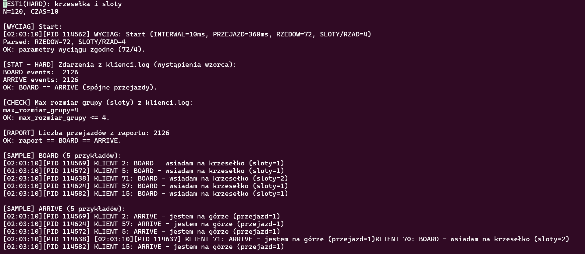
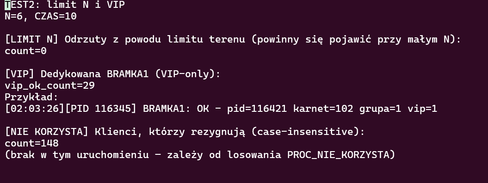
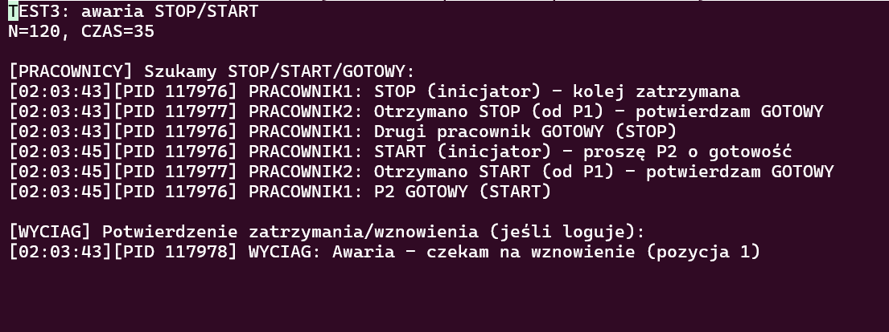
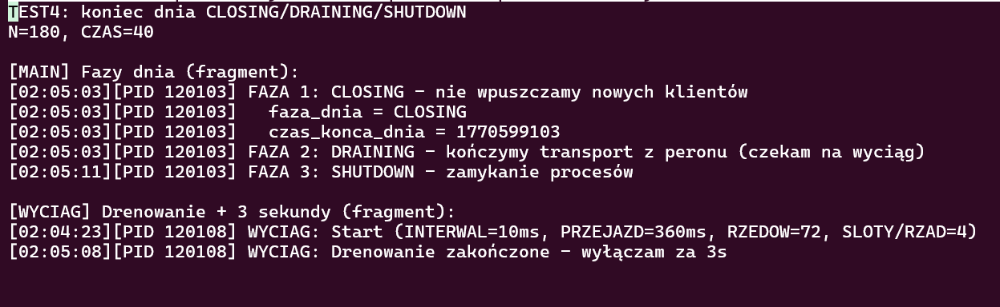

# Kolej krzesełkowa – mini sprawozdanie (v3.9.1)

## Środowisko
- Linux / WSL2 (Ubuntu) lub uruchomienie przez SSH
- Kompilator: GCC
- Mechanizmy IPC: System V (Shared Memory, Semafory, Kolejki komunikatów)

---

## 1. Opis zadania (wymagania)
W górskiej miejscowości działa krzesełkowa kolej linowa czynna w okresie letnim, obsługująca m.in. rowerowe trasy zjazdowe.

- Z kolei korzystają **piesi** oraz **rowerzyści**.
- Kolej w modelu składa się z **18 „rzędów” po 4 krzesełka** (łącznie **72 krzesełka / miejsca**). Jednocześnie w górę jedzie **9 rzędów**, więc może być zajętych maksymalnie **36 krzesełek** (druga połowa wraca pusta w dół).
- W jednym rzędzie (4 krzesełka) mogą jechać maksymalnie:
  - **2 rowerzystów** (2+2 miejsca), albo
  - **1 rowerzysta + 2 pieszych** (2+1+1), albo
  - **4 pieszych**.
- Turyści/rowerzyści przychodzą w losowych momentach (nie wszyscy muszą korzystać z kolei).
- Wejście na teren odbywa się po zakupie biletu/karnetu w kasie.
- Karnety: jednorazowe, czasowe (Tk1/Tk2/Tk3) lub dzienne.
- Zniżka 25%: dzieci < 10 lat i seniorzy 65+.
- Dzieci < 8 lat są pod stałą opieką osoby dorosłej; dorosły może opiekować się max. **dwójką** dzieci (4–8 lat).
- Bramki:
  - wejście na teren dolnej stacji: **4 bramki** (kontrola karnetu),
  - wejście na peron: **3 bramki** otwierane przez **pracownik1**.
- Na terenie dolnej stacji (między 1. bramkami a peronem) może przebywać maksymalnie **N osób**.
- Stacja dolna: **pracownik1**, stacja górna: **pracownik2**.
- Awaria: pracownik1 lub pracownik2 zatrzymuje kolej (**sygnał1**), a wznowienie (**sygnał2**) następuje po komunikacji z drugim pracownikiem i potwierdzeniu gotowości.
- Po osiągnięciu czasu zamknięcia **Tk**: bramki przestają akceptować karnety, osoby już na peronie muszą zostać przetransportowane na górę, a następnie po **3 sekundach** kolej ma się wyłączyć.
- VIP (~1%): wchodzą na teren dolnej stacji **bez kolejki**, używając karnetu.


---

## 2. Uruchomienie

### 2.1. Kompilacja
```bash
make
```

### 2.2. Start symulacji
Program uruchamia się poleceniem:

```bash
./main N CZAS
```

Gdzie:
- `N` – limit osób, które mogą jednocześnie przebywać **na terenie dolnej stacji** (między bramkami wejściowymi a peronem).
- `CZAS` – czas pracy symulacji w sekundach; po jego upływie uruchamia się procedura końca dnia (CLOSING → DRAINING → SHUTDOWN).

Przykład:
```bash
./main 20 30
```

### 2.3. Podgląd logów (WSL2 / SSH)
Najwygodniej w WSL2/SSH uruchomić wersję „demo” w tmux (nie wymaga GUI):

```bash
./demo_tmux_terminale.sh 20 30
```

(Uwaga: przewijanie w tmux: `Ctrl+b` potem `[`; wyjście: `q`.)

Jeśli nie używasz tmux, można w osobnych terminalach wykonać:
```bash
tail -F output/main.log output/pracownicy.log output/sprzatacz.log
```
```bash
tail -F output/generator.log
```
```bash
tail -F output/kasa.log output/bramki.log
```
```bash
tail -F output/wyciag.log output/klienci.log
```

---

## 3. Architektura programu

### 3.1. Procesy
- **main** – koordynator: tworzy IPC, uruchamia procesy, zarządza fazami dnia i końcem symulacji.
- **generator** – tworzy procesy klientów (fork+exec) i loguje parametry klientów.
- **kasjer** – sprzedaje karnety (odmawia w CLOSING/DRAINING).
- **bramki (4× bramka1)** – kontrola wejścia na teren dolnej stacji (weryfikacja karnetu + limit N).
- **pracownik1** – obsługa stacji dolnej, w tym „bramki peronu” (3 wirtualne bramki).
- **wyciąg** – symulacja obiegu **18 rzędów × 4 krzesełka (72 miejsca)**: w danym momencie **9 rzędów** jedzie w górę (max **36 zajętych krzesełek/miejsc**), a 9 wraca pusta w dół.
- **pracownik2** – obsługa stacji górnej oraz udział w procedurze STOP/START.
- **sprzątacz** – proces ochronny: w razie awarii/crasha czyści IPC i dobija procesy.
- **klient** – cykl życia klienta: kasa → bramki wejściowe → peron → wyciąg → zjazd → (powtórka lub zakończenie).

### 3.2. Przepływ klienta (skrót)
1. **Decyzja „czy korzysta”** – część klientów odchodzi bez kupowania (zgodnie z wymaganiem „nie wszyscy muszą korzystać”).
2. **Kasa** → zakup karnetu.
3. **Bramka wejściowa (1. strefa)** → wejście na teren dolnej stacji (limit N).
4. **Peron (pracownik1)** → kontrola wejścia na peron przez 3 bramki.
5. **Wyciąg** → żądanie przejazdu, wejście na krzesełko (do 4 miejsc/slotów), dojazd na górę.
6. **Góra + zjazd** → klient „zjeżdża” losową trasą i wraca na dół.
7. Koniec: gdy karnet nieważny / koniec dnia / odmowa w którejś strefie.

### 3.3. IPC w skrócie
- **Pamięć dzielona (SHM):** globalny stan symulacji (faza dnia, liczniki osób, statystyki, PIDy procesów, flagi awarii/panic).
- **Semafory:**
  - `SEM_TEREN` – limit **N** osób na dolnej stacji.
  - `SEM_PERON` – limit miejsc na pojedynczym krzesełku (4 „sloty”).
  - `SEM_MUTEX_SHM` – mutex do krytycznych aktualizacji SHM.
  - `SEM_BARIERA_AWARIA` – bariera blokująca procesy podczas awarii.
- **Kolejki komunikatów (MQ):**
  - Kasa: żądania i odpowiedzi.
  - Bramki: żądania i odpowiedzi.
  - Peron: żądania klientów + odpowiedzi pracownika1.
  - Wyciąg: żądania BOARD + odpowiedzi BOARD/ARRIVE.
  - Pracownicy: komunikacja STOP/START.

### 3.4. VIP
VIP jest realizowany przez **wydzieloną bramkę wejściową (nr 1)**, z której korzystają wyłącznie klienci VIP. Klienci „normalni” wybierają bramki 2–4. Dzięki temu VIP nie czeka w tej samej kolejce.

### 3.5. Awaria (STOP/START)
- **Sygnał1 = SIGUSR1 (STOP):** inicjator (pracownik1 lub pracownik2) zatrzymuje kolej (ustawia flagę awarii i blokuje ruch).
- **Sygnał2 = SIGUSR2 (START):** wznawia **ten sam pracownik, który zatrzymał** – wysyła komunikat do drugiego pracownika i czeka na odpowiedź gotowości; potem odblokowuje barierę i uruchamia kolej.

### 3.6. Koniec dnia (CLOSING → DRAINING → SHUTDOWN)
- **CLOSING:** nowe osoby nie są wpuszczane (bramki/kasa odmawiają), karnety „umierają” od `czas_konca_dnia`.
- **DRAINING:** wyciąg przewozi wszystkich, którzy **weszli już na teren dolnej stacji (między BRAMKA1 a peronem)** oraz tych, którzy są już **na peronie / na krzesełkach**; po opróżnieniu terenu/peronu/krzesełek czeka **3 sekundy** i kończy.
- **SHUTDOWN:** main zamyka pozostałe procesy i czyści IPC.

---

## 4. Logi
Logi są kierowane do plików w katalogu `output/` (podział pod wygodny pokaz w 4 panelach):

- `output/main.log` – start, fazy dnia, shutdown, statystyki
- `output/pracownicy.log` – STOP/START + handshake pracowników
- `output/generator.log` – tworzenie klientów i ich parametry
- `output/kasa.log` – sprzedaż karnetów
- `output/bramki.log` – decyzje bramek (OK/ODRZUT)
- `output/wyciag.log` – start pracy wyciągu, awarie, drenowanie
- `output/klienci.log` – „ścieżka życia” klientów (kasa/bramki/peron/BOARD/ARRIVE/koniec)
- `output/sprzatacz.log` – awaryjne sprzątanie (jeśli potrzebne)

---

## 5. Testy (skrypty)

Poniżej znajduje się seria **8 testów** (skrypty w katalogu `tests/`), których celem jest sprawdzenie działania symulacji w warunkach “brzegowych” oraz potwierdzenie, że nie dochodzi do:
- **blokady / zakleszczenia** (np. przez semafory, MQ, DRAINING),
- **przekroczeń limitów** (np. limit miejsc/slotów, limit osób na terenie `N`),
- niekontrolowanego “rozjazdu” logiki (np. BOARD bez ARRIVE),
- problemów końca dnia (CLOSING → DRAINING → SHUTDOWN).

Każdy test zapisuje wyniki w `tests/results/<nazwa_testu>_<timestamp>/summary.txt`.
Do raportu dołączone są zrzuty ekranu z plików `summary.txt` (oraz ewentualnie z logów `output/*.log`).


### Test 1 – Limity rzędów/krzesełek i zasady sadzania (18×4=72, 9×4=36)

**Cel:** potwierdzenie modelu 72 krzesełek (w obiegu) i limitu 4 slotów na krzesełko (pieszy=1, rowerzysta=2; dzieci liczone jako osoby w grupie), oraz spójności przejazdów (**BOARD == ARRIVE**).

**Uruchomienie (przykład):**
```bash
./tests/test1_krzeselka_i_sloty.sh 120 10
```

**Warunki wejściowe:** `N=120`, `CZAS=10` (intensywny ruch – dużo zdarzeń w krótkim czasie).

**Sprawdzenia (co jest w `summary.txt`):**
1. Linia startowa wyciągu: `RZEDOW=18` oraz `KRZESLA_W_RZEDZIE=4` → potwierdza parametry modelu.
2. “Twarde” liczenie zdarzeń z `klienci.log`:
   - liczba wystąpień `KLIENT <id>: BOARD` i `KLIENT <id>: ARRIVE`,
   - wymagane: **BOARD == ARRIVE** (brak “znikających” przejazdów).
3. Maksymalny rozmiar grupy w logach klientów (`max_rozmiar_grupy`) – wymagane: **≤ 4**.
4. Zgodność z raportem dziennym: `Liczba przejazdów` == BOARD == ARRIVE.

**Oczekiwany wynik:** `OK: parametry 72/4`, `OK: BOARD == ARRIVE`, `OK: max_rozmiar_grupy <= 4`, oraz zgodność z raportem.



### Test 2 – Limit osób na terenie (N) + VIP + “nie korzysta”

**Cel:** sprawdzenie trzech wymagań funkcjonalnych:
1) limitu liczby osób na terenie dolnej stacji (`N`) i braku zakleszczeń przy odrzutach,  
2) obsługi VIP (dedykowana bramka VIP-only),  
3) poprawnego zachowania klientów, którzy “przychodzą i odchodzą” (nie korzystają z kolei).

**Uruchomienie (przykład):**
```bash
./tests/test2_limitN_i_vip.sh 6 10
```

**Warunki wejściowe:** małe `N`, krótki czas (intensywny napływ klientów).

#### 2A) Limit N – wymuszenie odrzutów (ważne do screena)
W Twoim logu dla `N=6` wyszło `count=0`. To jest możliwe, bo przy danym losowaniu i krótkim czasie ruch mógł “przejść” bez zapełnienia terenu.

**Jak wymusić odrzuty do screena:**
- uruchom test z jeszcze mniejszym `N` (np. `N=2` albo `N=3`) i/lub wydłuż czas:
```bash
./tests/test2_limitN_i_vip.sh 2 15
```
Wtedy w `bramki.log` powinny pojawić się wpisy typu `ODRZUT - brak miejsca` (teren pełny) i licznik `count` będzie > 0.

**Oczekiwany wynik (część limit N):**
- pojawiają się odrzuty z powodu limitu terenu,
- symulacja nadal działa (brak deadlocka na semaforach i MQ).

#### 2B) VIP – brak kolejki przez dedykowaną bramkę
**Sprawdzenie:** w `summary.txt` jest:
- `vip_ok_count > 0` oraz przykład wpisu z `BRAMKA1: OK ... vip=1`.

**Oczekiwany wynik:** VIP przechodzi przez dedykowaną bramkę, bez “utknięcia” w kolejce zwykłych bramek.

#### 2C) “Nie korzysta”
**Sprawdzenie:** zliczane są linie w `klienci.log` typu:
- `odchodzi - dziś nie korzysta z kolei ...`

**Oczekiwany wynik:** `count > 0` (dla `PROC_NIE_KORZYSTA=10%` zwykle pojawi się kilka/ kilkadziesiąt wpisów, zależnie od liczby klientów w czasie testu).



### Test 3 – Awaria STOP/START (pracownik1/pracownik2) + brak zakleszczeń

**Cel:** potwierdzenie wymagań awarii:
- pracownik1 lub pracownik2 zatrzymuje kolej (STOP – sygnał 1),
- inicjator komunikuje się z drugim pracownikiem,
- po potwierdzeniu GOTOWY kolej jest wznawiana (START – sygnał 2),
- brak deadlocka (wyciąg “czeka na wznowienie” i wraca do pracy).

**Uruchomienie (przykład):**
```bash
./tests/test3_awaria_stop_start.sh 120 35
```

**Procedura testu (co robi skrypt):**
1. Uruchamia symulację.
2. Wysyła STOP (SIGUSR1) do `pracownik1`.
3. Po chwili wysyła START (SIGUSR2) do `main` (który uruchamia procedurę wznowienia).
4. Czeka na zakończenie.

**Sprawdzenia (w `summary.txt`):**
- w `pracownicy.log` musi być sekwencja: `STOP (inicjator)` → `P2 GOTOWY (STOP)` → `START (inicjator)` → `P2 GOTOWY (START)`.
- w `wyciag.log` musi pojawić się informacja o awarii i oczekiwaniu na wznowienie (np. `Awaria - czekam na wznowienie`).

**Oczekiwany wynik:** poprawny handshake STOP/START i brak “zawisu” wyciągu.



### Test 4 – Koniec dnia: CLOSING → DRAINING → SHUTDOWN (+ 3 sekundy)

**Cel:** potwierdzenie wymagań końca dnia:
- po osiągnięciu Tk bramki nie wpuszczają nowych klientów (CLOSING),
- wyciąg przewozi wszystkich, którzy już są “w systemie” (DRAINING),
- po opróżnieniu następuje oczekiwanie 3 sekundy i zakończenie (SHUTDOWN).

**Uruchomienie (przykład):**
```bash
./tests/test4_koniec_dnia_drenowanie.sh 180 40
```

**Sprawdzenia (w `summary.txt`):**
- w `main.log` widać przejście przez fazy: `FAZA 1: CLOSING`, `FAZA 2: DRAINING`, `FAZA 3: SHUTDOWN`.
- w `wyciag.log` widać: `Drenowanie zakończone - wyłączam za 3s`.

**Oczekiwany wynik:** brak blokady w DRAINING, procesy kończą się kontrolowanie, IPC jest czyszczone.




### Test 5 – Komunikacja end-to-end (kasa → bramka → peron → wyciąg)

**Cel:** pokazać na jednym przykładzie, że komunikaty przechodzą przez wiele procesów: klient kupuje karnet, przechodzi bramki, wchodzi na peron i dostaje od wyciągu `BOARD/ARRIVE`.

**Uruchomienie (przykład):**
```bash
./tests/test5_komunikacja_end_to_end.sh
```

**Co skrypt zapisuje do `summary.txt`:**
- wybiera jednego klienta (id+pid) z `klienci.log`,
- pokazuje fragmenty `klienci.log`, `kasa.log`, `bramki.log`, `main.log` dla **tego samego pid** (dowód komunikacji przez MQ),
- (jeśli jest `./monitor`) dorzuca snapshot w trakcie działania.

**Oczekiwany wynik:** w `summary.txt` widać spójny łańcuch zdarzeń dla jednego pid.

### Test 6 – Skrajność: SIGSTOP kasjera i backlog na MQ

**Cel:** zasymulować chwilowe zatrzymanie procesu kasjera (`SIGSTOP`) i pokazać, że: (1) kolejka do kasy się zapełnia (msg_qnum rośnie), (2) po `SIGCONT` system wraca do pracy i backlog maleje.

**Uruchomienie (przykład):**
```bash
./tests/test6_skrajnosci_sigstop_kolejki.sh
```

**Sprawdzenia:**
- `summary.txt` zawiera 3 snapshoty z `./monitor`: przed STOP, w trakcie STOP, po CONT,
- w `kasa.log` widać, że po wznowieniu znowu sprzedaje,
- symulacja kończy się normalnie (brak deadlocka).

**Oczekiwany wynik:** w trakcie STOP kolejki rosną, po CONT wracają do normy.

### Test 7 – Edge case: ubicie klienta na peronie (SEM_UNDO)

**Cel:** pokazać, że gdy klient zginie na peronie (np. `SIGTERM`), to dzięki `SEM_UNDO` nie zostawia „zajętych na zawsze” slotów i inni klienci nadal mogą wsiadać.

**Uruchomienie (przykład):**
```bash
./tests/test7_sigterm_klient_na_peronie_semundo.sh
```

**Oczekiwany wynik:** po ubiciu jednego klienta w logach nadal pojawiają się `BOARD/ARRIVE`, a koniec dnia przechodzi bez blokady.

### Test 8 – Edge case: crash main i sprzątacz IPC (crash-safe cleanup)

**Cel:** zademonstrować, że po „twardym” zabiciu `main` (np. `SIGKILL`) sprzątacz ubija pozostałe procesy i usuwa zasoby SysV IPC (SHM/SEM/MQ), dzięki czemu następne uruchomienie startuje czysto.

**Uruchomienie (przykład):**
```bash
./tests/test8_crash_main_sprzatacz_cleanup.sh
```

**Oczekiwany wynik:** skrypt pokazuje, że obiekty IPC o kluczach z `FTOK_FILE` znikają po crashu.

## 6. Linki do istotnych fragmentów kodu (wymagane konstrukcje)

**Baza (commit SHA do permanentnych linków):** `a79edbb522df59af884fbba1ec98146ae964a1b6`

a) **Tworzenie i obsługa plików** *(creat(), open(), close(), read(), write(), unlink())*
- `open()/close()/read()/write()` – mechanizm “owner lock” + zapis/odczyt flag stanu:  
  https://github.com/DuckyMein/kolej-linowa/blob/a79edbb522df59af884fbba1ec98146ae964a1b6/main.c#L118-L173
- `open(O_CREAT, …)` + `close()` – przygotowanie plików logów:  
  https://github.com/DuckyMein/kolej-linowa/blob/a79edbb522df59af884fbba1ec98146ae964a1b6/main.c#L489-L512
- `creat()` / `unlink()` – **nieużyte jawnie** (tworzenie plików realizowane przez `open(O_CREAT, …)`).

b) **Tworzenie procesów** *(fork(), exec(), exit(), wait())*
- `fork()` + `execv()` + `_exit()` – uruchamianie procesów stałych:  
  https://github.com/DuckyMein/kolej-linowa/blob/a79edbb522df59af884fbba1ec98146ae964a1b6/main.c#L514-L542
- `fork()` + `execv()` + `_exit()` – generator uruchamia proces klienta:  
  https://github.com/DuckyMein/kolej-linowa/blob/a79edbb522df59af884fbba1ec98146ae964a1b6/generator.c#L153-L187
- `waitpid(WNOHANG)` – sprzątanie zombie (main):  
  https://github.com/DuckyMein/kolej-linowa/blob/a79edbb522df59af884fbba1ec98146ae964a1b6/main.c#L101-L104
- `waitpid(WNOHANG)` – zbieranie zakończonych klientów (generator):  
  https://github.com/DuckyMein/kolej-linowa/blob/a79edbb522df59af884fbba1ec98146ae964a1b6/generator.c#L206-L211

c) **Tworzenie i obsługa wątków** *(pthread_create(), pthread_join(), …)*
- `pthread_create()` / `pthread_join()` / `pthread_exit()` oraz `pthread_mutex_*` i `pthread_cond_*`  
  (wątki “dzieci” zsynchronizowane z opiekunem – bez udziału w IPC):  
  https://github.com/DuckyMein/kolej-linowa/blob/a79edbb522df59af884fbba1ec98146ae964a1b6/klient.c#L32-L170
- Flagi kompilacji/linkowania `-pthread`:  
  https://github.com/DuckyMein/kolej-linowa/blob/a79edbb522df59af884fbba1ec98146ae964a1b6/Makefile#L6-L7
- `pthread_detach()` / `pthread_mutex_trylock()` / `pthread_cond_signal()` / `pthread_cond_broadcast()` –  
  **częściowo**: `pthread_cond_broadcast()` jest użyte; pozostałe (detach/trylock/signal) nie są potrzebne w tym wariancie.

d) **Obsługa sygnałów** *(kill(), raise(), signal(), sigaction())*
- `sigaction()` – instalacja handlerów w `main`:  
  https://github.com/DuckyMein/kolej-linowa/blob/a79edbb522df59af884fbba1ec98146ae964a1b6/main.c#L276-L314
- `kill(-pgid, …)` – sprzątacz ubija grupę procesów symulacji:  
  https://github.com/DuckyMein/kolej-linowa/blob/a79edbb522df59af884fbba1ec98146ae964a1b6/sprzatacz.c#L158-L165
- `raise()` / `signal()` – **nieużyte** (zamiast tego konsekwentnie `sigaction()`).

e) **Synchronizacja procesów** *(ftok(), semget(), semctl(), semop())*
- `ftok()` + `semget()` + `semctl(SETALL/IPC_RMID)` – tworzenie semaforów (minimalne prawa `IPC_PERMS`):  
  https://github.com/DuckyMein/kolej-linowa/blob/a79edbb522df59af884fbba1ec98146ae964a1b6/ipc.c#L116-L167  
  oraz definicja praw: https://github.com/DuckyMein/kolej-linowa/blob/a79edbb522df59af884fbba1ec98146ae964a1b6/config.h#L164
- `semop()` – operacje P/V (mutexy, peron, try-wait):  
  https://github.com/DuckyMein/kolej-linowa/blob/a79edbb522df59af884fbba1ec98146ae964a1b6/ipc.c#L513-L660

f) **Łącza nazwane i nienazwane** *(mkfifo(), pipe(), dup(), dup2(), popen())*
- `dup2()` – przekierowanie `stdout/stderr` procesu do pliku logów (dla procesów uruchamianych przez main):  
  https://github.com/DuckyMein/kolej-linowa/blob/a79edbb522df59af884fbba1ec98146ae964a1b6/main.c#L525-L531
- `dup2()` – przekierowanie logów klientów w generatorze:  
  https://github.com/DuckyMein/kolej-linowa/blob/a79edbb522df59af884fbba1ec98146ae964a1b6/generator.c#L55-L62
- `mkfifo()` / `pipe()` / `popen()` – **nieużyte** w tym projekcie.

g) **Segmenty pamięci dzielonej** *(ftok(), shmget(), shmat(), shmdt(), shmctl())*
- `shmget()` + `shmat()` – tworzenie/attach SHM:  
  https://github.com/DuckyMein/kolej-linowa/blob/a79edbb522df59af884fbba1ec98146ae964a1b6/ipc.c#L168-L200
- `shmdt()` + `shmctl(IPC_RMID)` – odłączanie/usuwanie SHM:  
  https://github.com/DuckyMein/kolej-linowa/blob/a79edbb522df59af884fbba1ec98146ae964a1b6/ipc.c#L319-L334

h) **Kolejki komunikatów** *(ftok(), msgget(), msgsnd(), msgrcv(), msgctl())*
- `msgget()` + `msgctl(IPC_RMID)` (na `EEXIST`) – tworzenie kolejek:  
  https://github.com/DuckyMein/kolej-linowa/blob/a79edbb522df59af884fbba1ec98146ae964a1b6/ipc.c#L202-L309
- `msgctl(IPC_RMID)` – cleanup kolejek:  
  https://github.com/DuckyMein/kolej-linowa/blob/a79edbb522df59af884fbba1ec98146ae964a1b6/ipc.c#L345-L383
- `msgsnd()` / `msgrcv()` – wrappery send/recv (obsługa EINTR/EIDRM, try-nowait):  
  https://github.com/DuckyMein/kolej-linowa/blob/a79edbb522df59af884fbba1ec98146ae964a1b6/ipc.c#L667-L713

i) **Gniazda** *(socket(), bind(), listen(), accept(), connect())*
- **NIE DOTYCZY** – projekt korzysta z IPC System V (SHM + SEM + MQ), bez socketów.


---

## 7. Repozytorium
Link do repo: https://github.com/DuckyMein/kolej-linowa
